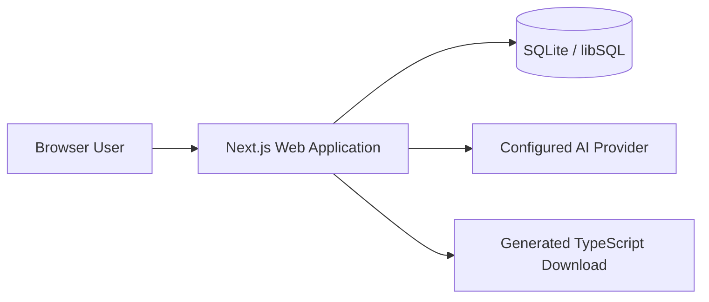
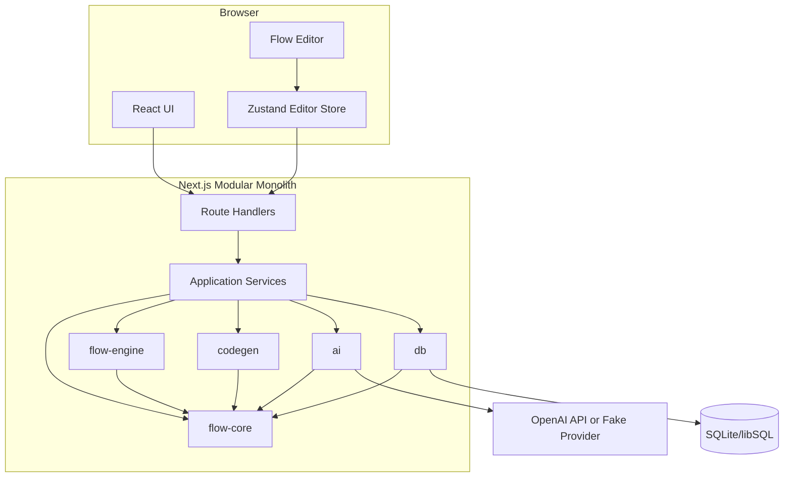
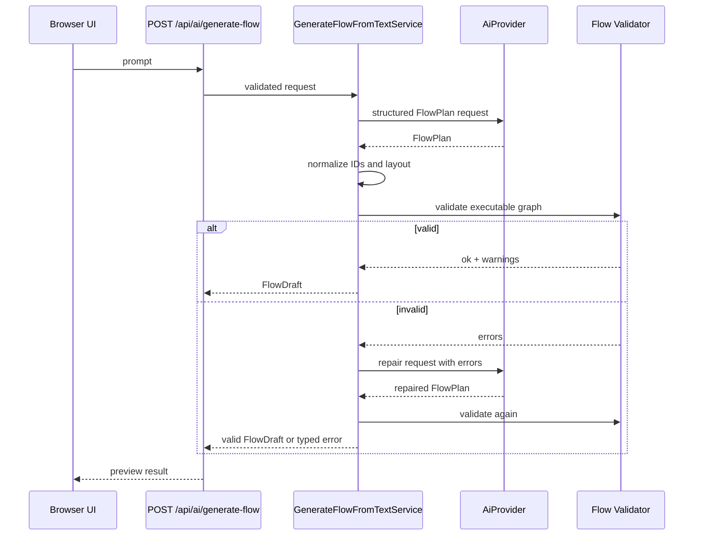
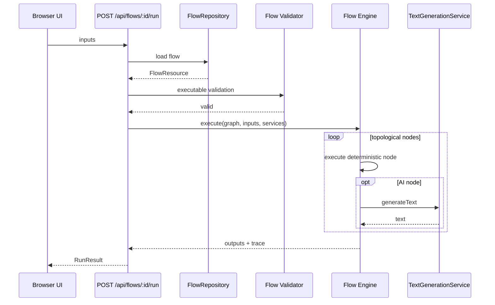

# AI Flow Builder 開発指示書

- 文書種別: Codex投入用・実装仕様書
- 対象: MVP v0.1.0
- 想定開発期間: 10営業日程度
- 開発方針: TypeScript中心、Webファースト、モジュラーモノリス、OSS前提
- 基準日: 2026-06-18

---

## 0. Codexへの最上位指示

この文書をリポジトリ直下の `DEVELOPMENT_SPEC.md` として扱い、以下を厳守すること。

1. **MVPの範囲を超える機能を追加しない。**
2. **ネットワーク境界を増やさない。** バックエンドはNext.jsアプリ内のモジュラーモノリスとする。
3. **React Flowの型を永続化モデルにしない。** 永続化するのは本書で定義するFlow IRである。
4. **LLM出力を信頼しない。** 必ず構造検証、許可リスト検証、グラフ検証を通す。
5. **生成コードをアプリ内で実行しない。** MVPでは表示・コピー・ダウンロードのみ提供する。
6. **任意JavaScript、Python、シェル、HTTPリクエストを実行するノードを実装しない。**
7. **`any`を原則禁止する。** 外部SDK境界で必要な場合のみ、局所化して理由をコメントする。
8. **環境変数の直接参照を散在させない。** `apps/web/src/server/config.ts` だけで読み込み・検証する。
9. **Route Handlerにビジネスロジックを書かない。** 入出力変換と例外マッピングに限定する。
10. **DBアクセスをRoute Handlerから直接行わない。** Application ServiceとRepositoryを経由する。
11. **すべてのIssueでテストを追加する。** テスト不能な実装を完了扱いにしない。
12. **依存パッケージを勝手に増やさない。** 本書記載外の依存追加は、ADR追加と理由説明を必須とする。
13. **Canary、alpha、beta版を使わない。** 安定版をロックファイルで固定する。
14. **実装完了時に `pnpm check` と対象E2Eを実行する。**
15. **未解決のTODOを残さない。** 残す場合は対応するGitHub Issue番号を併記する。

### 実装報告フォーマット

各Codexタスク完了時は、次を報告すること。

- 変更したファイル
- 実装した振る舞い
- 追加・更新したテスト
- 実行したコマンドと結果
- 残課題または仕様上の判断

---

# 1. プロダクトビジョン

## 1.1 ビジョン

AI Flow Builderは、AI時代のVisual Programming Platformである。

利用者はブラウザ上でノードを配置し、接続し、設定することで、入力から変換、AI処理、出力までのフローを構築できる。さらに自然言語で目的を説明すると、AIが実行可能なフロー案を生成する。完成したフローからは、再現可能なTypeScriptコードを生成できる。

目指す体験は、以下の製品群の長所を統合したものとする。

- Simulinkの「処理構造を視覚的に理解できる」体験
- Node-REDの「ノードをつなぎ、すぐ試せる」体験
- n8nの「ワークフローを構築・実行する」体験
- React Flowの「Web上で軽快にノードを操作する」体験
- AIコーディング支援の「自然言語から構造とコードを得る」体験

## 1.2 プロダクト原則

### 原則A: Flow IRを中心にする

画面、実行エンジン、AI、コード生成、永続化は、すべて共通のFlow IRを介して連携する。React Flowの内部表現や特定LLMのレスポンス形式を中心に置かない。

### 原則B: AIは提案者、検証器はコード

AIはフロー案を提案するが、正当性は決定論的なスキーマ検証とグラフ検証で判定する。不正なAI出力をそのまま保存または実行しない。

### 原則C: コード生成は再現可能にする

MVPのフローからTypeScriptへの変換は、LLMへの丸投げではなく決定論的なコードジェネレータで行う。これにより、同じFlow IRから常に同等のコードを得られる。

自然言語からFlow IRを生成する部分はAIが担当するため、自然言語からコードまでの一連の体験はAIネイティブである。

### 原則D: OSSとして小さく始める

MVPは単一デプロイ可能なモジュラーモノリスとし、認証、分散ジョブ、マイクロサービス、プラグインマーケットプレイスを導入しない。

### 原則E: AIがなくても基本機能が動く

APIキーが未設定でも、手動編集、保存、非AIノードの実行、コード生成は利用可能にする。AI機能だけを無効化する。

## 1.3 想定ユーザー

MVPで主に想定するユーザーは以下である。

- AI処理の試作を視覚的に行いたいソフトウェア開発者
- LLMを含む簡単な処理フローを短時間で組み立てたい技術者
- ノードベースUI、ワークフローエンジン、コード生成に関心があるOSSコントリビューター

## 1.4 MVP成功条件

MVPは、以下をすべて満たしたとき完成とする。

1. 利用者がブラウザ上でノードを追加、接続、移動、編集、削除できる。
2. フローを保存し、ページ再読込後に同じ状態へ復元できる。
3. 入力、テンプレート変換、AI生成、出力からなるDAGを実行できる。
4. 自然言語から、検証済みのフロー案を生成できる。
5. フローから、型検査可能なTypeScriptコードを生成できる。
6. AI APIキー未設定でも、非AI機能が動作する。
7. DockerまたはローカルNode.js環境で起動できる。
8. 主要ユースケースのE2EテストがCIで成功する。
9. READMEだけで初回起動できる。

---

# 2. MVP定義

## 2.1 MVPで提供する機能

### A. フロー管理

- フロー一覧表示
- 新規フロー作成
- フロー名・説明編集
- フロー保存
- フロー再読込
- フロー削除
- 更新日時表示
- 楽観的ロックによる競合検出

### B. ビジュアルエディタ

- ノードパレットからの追加
- ドラッグによるノード移動
- ハンドル間のエッジ接続
- ノード・エッジ削除
- 単一ノード選択
- 右側Inspectorでの設定変更
- ズーム、パン、Fit View
- Background、Controls、MiniMap
- Undo / Redo
- 自動保存
- 保存状態表示
- バリデーション結果表示

### C. 組み込みノード

MVPでは以下の4種類だけを実装する。

| kind | 表示名 | 役割 |
|---|---|---|
| `core.input.text` | Text Input | 実行時に文字列入力を受け取る |
| `core.text.template` | Text Template | `{{input}}` を文字列へ埋め込む |
| `ai.text.generate` | AI Generate | 入力文字列をプロンプトとしてLLMへ送る |
| `core.output.text` | Text Output | 最終出力として文字列を返す |

### D. フロー実行

- DAGのみ実行可能
- サーバー上で実行
- トポロジカル順序で逐次実行
- 入力値フォーム
- ノード別の実行状態・所要時間・プレビュー表示
- 最終出力表示
- 実行時バリデーション
- AIノードは設定済みProviderを利用
- 非AIノードだけのフローはAPIキーなしで実行可能

### E. 自然言語からフロー生成

- テキストプロンプト入力
- サポート済みノードだけでFlow Planを生成
- AI出力の構造検証
- ノードID再採番
- 決定論的自動レイアウト
- グラフ検証
- 失敗時の修復リトライ1回
- 生成結果のプレビュー
- 利用者の明示操作による適用
- 未対応要件と仮定事項の表示

### F. フローからTypeScriptコード生成

- 実行可能フローをTypeScriptへ変換
- `runFlow(inputs, deps)` 形式の関数生成
- AI呼び出しはDependency Injectionで表現
- Flow IR上のノードと生成コードの対応コメント
- コード表示
- コピー
- `.ts`ファイルとしてダウンロード
- スナップショットテスト
- 生成物のTypeScript型検査

### G. OSS基盤

- Repository licenseはApache-2.0とする
- README
- CONTRIBUTING
- CODE_OF_CONDUCT
- SECURITY
- GitHub Actions
- Issueテンプレート
- Pull Requestテンプレート
- `.env.example`
- Dockerfile
- 永続ボリューム利用手順

## 2.2 代表ユースケース

### ユースケース1: 手動でフローを作る

1. 新規フローを作成する。
2. Text Inputを配置する。
3. Text Templateを配置し、`Summarize the following:\n{{input}}` を設定する。
4. Text Outputを配置する。
5. ノードを接続する。
6. 保存する。
7. 入力値を指定して実行する。
8. 出力を確認する。

### ユースケース2: AIにフローを作らせる

1. 「入力文章をAIで要約し、結果を出力するフロー」と入力する。
2. AIがInput → Template → AI Generate → Outputの案を返す。
3. 利用者が警告・仮定を確認する。
4. Applyを押す。
5. 必要に応じて設定を修正する。
6. 実行する。

### ユースケース3: コードを生成する

1. 実行可能なフローを開く。
2. Generate Codeを押す。
3. 生成されたTypeScriptを確認する。
4. コピーまたはダウンロードする。

## 2.3 MVP規模上限

- 1フロー最大ノード数: 100
- 1フロー最大エッジ数: 200
- AIフロー生成プロンプト: 最大4,000文字
- ノードラベル: 最大80文字
- Template: 最大20,000文字
- 実行入力1項目: 最大50,000文字
- ノード出力1項目: 最大100,000文字
- フロー実行全体タイムアウト: 60秒
- AIフロー生成タイムアウト: 45秒
- Undo履歴: 最大50スナップショット

---

# 3. 非目標

以下はMVPでは実装しない。

## 3.1 ユーザー・組織機能

- ユーザー登録
- OAuth
- マルチテナント
- Organization / Workspace
- RBAC
- 共有リンク
- リアルタイム共同編集
- コメント

MVPは**単一ユーザーのローカルまたは信頼済みネットワーク向け**と明記する。公開インターネットへ認証なしで配置することを推奨しない。

## 3.2 高度なワークフロー機能

- ループ
- 条件分岐
- Switch
- Retryポリシー
- 並列実行最適化
- Cron
- Webhook受信
- 長時間ジョブ
- キュー
- Pause / Resume
- スケジューリング
- デプロイ済みワークフロー
- バージョン履歴
- 承認フロー

## 3.3 任意コード・外部接続

- JavaScript実行ノード
- Python実行ノード
- Shell実行ノード
- HTTP Requestノード
- DB Queryノード
- ファイルシステム操作ノード
- ブラウザ自動化ノード
- MCP接続
- Agent Tool呼び出し

## 3.4 プラグイン基盤

- 実行時動的プラグイン読み込み
- npmパッケージからのノード追加
- プラグインマーケットプレイス
- 署名・権限モデル

ただし、コンパイル時にNode Spec、Executor、Code Emitterを追加できる内部レジストリは実装する。

## 3.5 コード生成

- Python、Go、Rust、JavaなどTypeScript以外の生成
- フレームワーク固有コード生成
- 生成コードの自動実行
- 生成コードの自動デプロイ
- LLMによる自由形式の全面書き換え

## 3.6 モバイル・オフライン

- ネイティブアプリ
- モバイル最適化エディタ
- PWAオフライン同期
- IndexedDB優先アーキテクチャ

---

# 4. システムアーキテクチャ

## 4.1 アーキテクチャ方針

採用するのは、**単一デプロイ可能なモジュラーモノリス**である。

- UIとHTTP APIは1つのNext.jsアプリに配置する。
- ドメイン、実行、AI、コード生成、DBはワークスペース内パッケージとして分離する。
- パッケージ境界はネットワーク境界ではない。
- Queue、Redis、別APIサーバー、別Workerは置かない。
- AI呼び出しとフロー実行はNext.jsのNode.js Runtimeで同期的に処理する。

## 4.2 コンテキスト図



## 4.3 コンテナ図



## 4.4 依存方向

依存方向は次を厳守する。

```text
flow-core
  ↑       ↑       ↑       ↑
engine  codegen   ai      db
   \       |       |      /
          apps/web
```

禁止事項:

- `flow-core` からNext.js、React、DB、OpenAI SDKを参照しない。
- `flow-engine` からDBを参照しない。
- `codegen` からOpenAI SDKを参照しない。
- `db` からReact Flow型を参照しない。
- パッケージ間の循環依存を作らない。

## 4.5 レイヤー責務

### Presentation

- React画面
- React Flowアダプタ
- 入力フォーム
- APIクライアント
- UI状態

### HTTP Boundary

- RequestのJSON化
- ZodによるRequest検証
- Application Service呼び出し
- ErrorからHTTP Statusへの変換
- Response整形

### Application

- `FlowService`
- `RunFlowService`
- `GenerateFlowFromTextService`
- `GenerateCodeService`
- Use Case単位のトランザクション境界

### Domain

- Flow IR
- Node Spec
- Port型
- バリデーション
- グラフアルゴリズムの契約
- ドメインエラー

### Infrastructure

- Drizzle Repository
- libSQL Client
- OpenAI Adapter
- Logger
- Config

## 4.6 AIフロー生成シーケンス



## 4.7 フロー実行シーケンス



## 4.8 重要な設計判断

### React FlowとFlow IRを分離する

React Flowの `Node` / `Edge` をDBへそのまま保存しない。React Flowが追加する測定値、内部データ、将来のAPI変更を永続モデルへ持ち込まないためである。

### DBはフロー全体を1つのJSONとして保存する

MVPではノード・エッジ単位の検索要件がない。フロー編集は原子的に保存したい。そのため、1フロー1行、Graph JSON 1列とする。

### コード生成は決定論的にする

同じFlow IRから同等のコードを再生成でき、テスト可能で、安全性を確認しやすい。LLMはコード生成の唯一の情報源にしない。

### 実行履歴を永続化しない

MVPではRunResultをレスポンスとして返し、クライアントメモリに保持する。履歴テーブル、ログ検索、再実行は将来機能とする。

---

# 5. ディレクトリ構成

```text
ai-flow-builder/
├─ apps/
│  └─ web/
│     ├─ public/
│     ├─ src/
│     │  ├─ app/
│     │  │  ├─ layout.tsx
│     │  │  ├─ page.tsx
│     │  │  ├─ globals.css
│     │  │  ├─ flows/
│     │  │  │  └─ [flowId]/
│     │  │  │     ├─ page.tsx
│     │  │  │     ├─ loading.tsx
│     │  │  │     └─ error.tsx
│     │  │  └─ api/
│     │  │     ├─ health/route.ts
│     │  │     ├─ flows/route.ts
│     │  │     ├─ flows/[flowId]/route.ts
│     │  │     ├─ flows/[flowId]/run/route.ts
│     │  │     ├─ flows/[flowId]/code/route.ts
│     │  │     └─ ai/generate-flow/route.ts
│     │  ├─ components/
│     │  │  ├─ ui/
│     │  │  └─ app-shell/
│     │  ├─ features/
│     │  │  ├─ flows/
│     │  │  │  ├─ components/
│     │  │  │  └─ server/
│     │  │  ├─ editor/
│     │  │  │  ├─ components/
│     │  │  │  ├─ nodes/
│     │  │  │  ├─ inspector/
│     │  │  │  ├─ store/
│     │  │  │  ├─ adapters/
│     │  │  │  ├─ hooks/
│     │  │  │  └─ editor-types.ts
│     │  │  ├─ run/
│     │  │  ├─ codegen/
│     │  │  └─ ai-generation/
│     │  ├─ lib/
│     │  │  ├─ api-client.ts
│     │  │  ├─ cn.ts
│     │  │  └─ download.ts
│     │  └─ server/
│     │     ├─ config.ts
│     │     ├─ container.ts
│     │     ├─ logger.ts
│     │     ├─ http/
│     │     │  ├─ response.ts
│     │     │  └─ error-mapper.ts
│     │     └─ services/
│     │        ├─ flow-service.ts
│     │        ├─ run-flow-service.ts
│     │        ├─ generate-flow-service.ts
│     │        └─ generate-code-service.ts
│     ├─ next.config.ts
│     ├─ package.json
│     └─ tsconfig.json
├─ packages/
│  ├─ flow-core/
│  │  ├─ src/
│  │  │  ├─ schemas/
│  │  │  │  ├─ flow-graph.ts
│  │  │  │  ├─ flow-resource.ts
│  │  │  │  └─ api-contracts.ts
│  │  │  ├─ nodes/
│  │  │  │  ├─ node-spec.ts
│  │  │  │  ├─ builtins.ts
│  │  │  │  └─ registry.ts
│  │  │  ├─ validation/
│  │  │  │  ├─ validate-storage.ts
│  │  │  │  ├─ validate-executable.ts
│  │  │  │  └─ issues.ts
│  │  │  ├─ graph/
│  │  │  │  ├─ topological-sort.ts
│  │  │  │  ├─ reachability.ts
│  │  │  │  └─ layout.ts
│  │  │  ├─ migrations/
│  │  │  │  └─ migrate-flow-graph.ts
│  │  │  ├─ errors.ts
│  │  │  └─ index.ts
│  │  ├─ package.json
│  │  └─ tsconfig.json
│  ├─ flow-engine/
│  │  ├─ src/
│  │  │  ├─ executors/
│  │  │  │  ├─ input-text.ts
│  │  │  │  ├─ text-template.ts
│  │  │  │  ├─ ai-text-generate.ts
│  │  │  │  └─ output-text.ts
│  │  │  ├─ executor-registry.ts
│  │  │  ├─ execute-flow.ts
│  │  │  ├─ execution-types.ts
│  │  │  └─ index.ts
│  │  └─ package.json
│  ├─ codegen/
│  │  ├─ src/
│  │  │  ├─ code-generator.ts
│  │  │  ├─ generated-bundle.ts
│  │  │  ├─ typescript/
│  │  │  │  ├─ typescript-generator.ts
│  │  │  │  ├─ emitters/
│  │  │  │  ├─ naming.ts
│  │  │  │  └─ format.ts
│  │  │  └─ index.ts
│  │  └─ package.json
│  ├─ ai/
│  │  ├─ src/
│  │  │  ├─ ai-provider.ts
│  │  │  ├─ ai-result.ts
│  │  │  ├─ flow-plan-schema.ts
│  │  │  ├─ prompts/
│  │  │  │  ├─ generate-flow-v1.ts
│  │  │  │  └─ repair-flow-v1.ts
│  │  │  ├─ providers/
│  │  │  │  ├─ openai-provider.ts
│  │  │  │  ├─ fake-provider.ts
│  │  │  │  └─ disabled-provider.ts
│  │  │  ├─ normalize-flow-plan.ts
│  │  │  └─ index.ts
│  │  └─ package.json
│  └─ db/
│     ├─ src/
│     │  ├─ client.ts
│     │  ├─ schema.ts
│     │  ├─ flow-repository.ts
│     │  ├─ drizzle-flow-repository.ts
│     │  └─ index.ts
│     ├─ drizzle.config.ts
│     ├─ migrations/
│     └─ package.json
├─ e2e/
│  ├─ editor.spec.ts
│  ├─ ai-generation.spec.ts
│  ├─ run-flow.spec.ts
│  └─ codegen.spec.ts
├─ docs/
│  ├─ architecture.md
│  ├─ api.md
│  ├─ node-authoring.md
│  └─ adr/
│     ├─ 0001-modular-monolith.md
│     ├─ 0002-domain-flow-ir.md
│     ├─ 0003-deterministic-codegen.md
│     ├─ 0004-single-user-sqlite-mvp.md
│     └─ 0005-no-arbitrary-code-execution.md
├─ .github/
│  ├─ workflows/ci.yml
│  ├─ ISSUE_TEMPLATE/
│  └─ pull_request_template.md
├─ data/.gitkeep
├─ scripts/
│  ├─ migrate.ts
│  └─ seed-demo-flow.ts
├─ .env.example
├─ .gitignore
├─ .nvmrc
├─ Dockerfile
├─ docker-compose.yml
├─ LICENSE
├─ README.md
├─ CONTRIBUTING.md
├─ CODE_OF_CONDUCT.md
├─ SECURITY.md
├─ package.json
├─ pnpm-lock.yaml
├─ pnpm-workspace.yaml
├─ tsconfig.base.json
├─ eslint.config.mjs
└─ prettier.config.mjs
```

## 5.1 ディレクトリ規約

- `features/*` は機能単位でUI、hook、局所型をまとめる。
- `components/ui` は汎用UIだけを置く。
- サーバー専用コードは `server-only` を使用し、Client Componentからimportできないようにする。
- 各packageの公開APIは `src/index.ts` に限定する。
- 他packageの内部パスを直接importしない。
- テストは対象ファイル近傍の `*.test.ts` または `*.test.tsx` とする。
- E2Eだけをルート `e2e/` に置く。

---

# 6. 技術スタック

## 6.1 基盤

| 領域 | 採用技術 | 方針 |
|---|---|---|
| Runtime | Node.js 24 LTS | `.nvmrc` と `engines` で固定 |
| Package Manager | pnpm 11 | Workspace利用、lockfile必須 |
| Language | TypeScript | `strict: true`、ESM優先 |
| Monorepo | pnpm workspace | Turborepoは導入しない |
| Web Framework | Next.js App Router | 安定版、Node Runtime |
| UI | React | Next.js推奨安定版 |
| Graph Editor | `@xyflow/react` v12系 | Controlled mode |
| Styling | Tailwind CSS | CSS変数でテーマ化 |
| UI Parts | shadcn/uiの必要最小限 | Button、Dialog、Tabs、Input等 |
| Icon | lucide-react | 一貫したアイコン |
| Client State | Zustand | Editorの状態・Undo/Redo |
| Form | React Hook Form | Inspectorフォーム |
| Validation | Zod | Domain、API、環境変数、AI出力 |
| ORM | Drizzle ORM | 型安全なRepository実装 |
| Database | libSQL/SQLite | ローカルファイルを標準 |
| AI SDK | OpenAI公式TypeScript SDK | Adapterの内部に隔離 |
| Unit Test | Vitest | Domain中心 |
| Component Test | Testing Library | 必要箇所のみ |
| E2E | Playwright | 主要4シナリオ |
| Lint | ESLint | TypeScript、React、Next.js |
| Format | Prettier | コード・生成コード整形 |
| Logging | Pino | サーバー構造化ログ |
| Container | Docker | multi-stage、永続volume |

## 6.2 採用しない技術

- NestJS
- Express別サーバー
- GraphQL
- tRPC
- Redis
- BullMQ
- Kafka
- Temporal
- Kubernetes定義
- WebSocket
- CRDT
- Prisma
- Monaco Editor
- ELK/Dagreレイアウト依存

理由はMVPの依存・概念数を抑えるためである。自動レイアウトは小さな決定論的実装を `flow-core` に置く。

## 6.3 バージョン方針

- メジャーバージョンを `package.json` で明示する。
- `pnpm-lock.yaml` を必ずコミットする。
- `latest`、`next`、`canary` をpackage.jsonに残さない。
- CIは `pnpm install --frozen-lockfile` を使う。
- RenovateまたはDependabotはMVP終盤で有効化する。
- 依存更新PRでは `pnpm check` とE2Eを必須とする。

## 6.4 TypeScript規約

- `strict: true`
- `noUncheckedIndexedAccess: true`
- `exactOptionalPropertyTypes: true`
- `useUnknownInCatchVariables: true`
- `noImplicitOverride: true`
- `verbatimModuleSyntax: true`
- `skipLibCheck: false` を原則とする。外部依存で阻害される場合のみADRに記録する。
- Domain IDは単なる`string`の乱用を避け、branded typeまたはZod brandを検討する。ただし過度な型体操は禁止する。

## 6.5 ルートスクリプト

最低限、以下を提供する。

```jsonc
{
  "scripts": {
    "dev": "pnpm --filter @ai-flow-builder/web dev",
    "build": "pnpm -r build",
    "lint": "pnpm -r lint",
    "typecheck": "pnpm -r typecheck",
    "test": "pnpm -r test",
    "test:unit": "pnpm -r test:unit",
    "test:e2e": "playwright test",
    "format": "prettier --write .",
    "format:check": "prettier --check .",
    "db:generate": "pnpm --filter @ai-flow-builder/db db:generate",
    "db:migrate": "pnpm --filter @ai-flow-builder/db db:migrate",
    "check": "pnpm format:check && pnpm lint && pnpm typecheck && pnpm test"
  }
}
```

実際のpackage名とコマンドは整合させること。

---

# 7. データモデル

## 7.1 Flow IRの位置づけ

Flow IRは、以下すべての共通契約である。

- ブラウザエディタ
- API
- DB永続化
- フロー実行エンジン
- AIフロー生成
- コード生成
- 将来のインポート・エクスポート

Flow IRはReact Flowから独立させる。

## 7.2 識別子

- Flow ID: `crypto.randomUUID()` で生成するUUID
- Node ID: UUID
- Edge ID: UUID
- AIの一時参照ID: Flow Plan内だけで使用する短い英数字文字列
- DB ID生成を外部サービスへ依存させない

## 7.3 FlowResource

概念上の契約は以下とする。

```ts
interface FlowResource {
  id: string;
  name: string;
  description: string | null;
  graph: FlowGraph;
  revision: number;
  createdAt: string;
  updatedAt: string;
}
```

### 制約

- `name`: 1〜120文字
- `description`: 最大2,000文字
- `revision`: 1から始まる単調増加整数
- 日時はAPIではISO 8601文字列

## 7.4 FlowGraph

```ts
interface FlowGraph {
  schemaVersion: 1;
  nodes: FlowNode[];
  edges: FlowEdge[];
  viewport: {
    x: number;
    y: number;
    zoom: number;
  };
}
```

### viewport制約

- `x`, `y`: 有限数
- `zoom`: 0.1〜4
- viewportは実行意味論に影響しない

## 7.5 FlowNode

```ts
interface FlowNode {
  id: string;
  kind:
    | 'core.input.text'
    | 'core.text.template'
    | 'ai.text.generate'
    | 'core.output.text';
  specVersion: 1;
  position: {
    x: number;
    y: number;
  };
  label: string;
  config: unknown;
}
```

### 共通制約

- `id`: FlowGraph内で一意
- `position.x`, `position.y`: 有限数
- `label`: 1〜80文字
- `kind` と `specVersion` の組み合わせがNode Registryに存在すること
- `config` はNode Spec固有のZod schemaで検証する
- 未知フィールドは保存時に黙って残さず、strict schemaで拒否する

## 7.6 FlowEdge

```ts
interface FlowEdge {
  id: string;
  source: {
    nodeId: string;
    portId: string;
  };
  target: {
    nodeId: string;
    portId: string;
  };
}
```

### 制約

- `id`: FlowGraph内で一意
- source/target nodeが存在する
- source portとtarget portがNode Specに存在する
- source portはoutput、target portはinputである
- self-loopは禁止
- 同じtarget input portへの複数edgeは禁止
- 同一source-target-portの重複edgeは禁止

## 7.7 Port型

将来拡張を考慮し、型のunionは定義するが、MVPで実装するのは`text`のみとする。

```ts
type PortDataType = 'text' | 'number' | 'boolean' | 'json' | 'any';

interface PortSpec {
  id: string;
  label: string;
  direction: 'input' | 'output';
  dataType: PortDataType;
  required: boolean;
}
```

MVPでは型互換性は以下だけでよい。

- `text -> text`: 許可
- `T -> any`: 将来用。MVPの組み込みノードでは未使用
- `any -> T`: 将来用。MVPの組み込みノードでは未使用
- その他: 不許可

## 7.8 Node Spec

```ts
interface NodeSpec<TConfig> {
  kind: string;
  version: number;
  displayName: string;
  description: string;
  category: 'input' | 'transform' | 'ai' | 'output';
  configSchema: ZodType<TConfig>;
  inputs: readonly PortSpec[];
  outputs: readonly PortSpec[];
  defaultConfig: TConfig;
  defaultLabel: string;
}
```

Node SpecにReact Component、DB Client、AI SDKを含めない。

## 7.9 組み込みノード仕様

### 7.9.1 `core.input.text@1`

```ts
interface TextInputConfig {
  key: string;
  label: string;
  required: boolean;
  defaultValue?: string;
}
```

Ports:

- output: `value`, type `text`

制約:

- `key`: `/^[A-Za-z_][A-Za-z0-9_]*$/`
- `key`: Flow内のText Input間で一意
- `label`: 1〜80文字
- `defaultValue`: 最大50,000文字

実行:

1. `inputs[config.key]` が存在すればそれを返す。
2. なければ `defaultValue` を返す。
3. `required=true` かつ値がなければエラー。

### 7.9.2 `core.text.template@1`

```ts
interface TextTemplateConfig {
  template: string;
}
```

Ports:

- input: `input`, type `text`, required
- output: `text`, type `text`

制約:

- `template`: 1〜20,000文字
- 使用可能なプレースホルダーは `{{input}}` のみ
- 未知の `{{...}}` を含む場合は実行前エラー

実行:

- すべての `{{input}}` を入力文字列へ置換する。
- テンプレートエンジンや任意式評価は使わない。

### 7.9.3 `ai.text.generate@1`

```ts
interface AiTextGenerateConfig {
  systemPrompt?: string;
}
```

Ports:

- input: `prompt`, type `text`, required
- output: `text`, type `text`

制約:

- `systemPrompt`: 最大10,000文字
- model、temperature、API keyはノードごとに設定しない
- providerとmodelはサーバー環境変数で設定する

実行:

- `TextGenerationService.generateText()` を呼ぶ。
- Provider無効時は `AI_DISABLED`。
- 入出力制限とAbortSignalを適用する。

### 7.9.4 `core.output.text@1`

```ts
interface TextOutputConfig {
  key: string;
  label: string;
}
```

Ports:

- input: `value`, type `text`, required

制約:

- `key`: `/^[A-Za-z_][A-Za-z0-9_]*$/`
- `key`: Flow内のText Output間で一意

実行:

- `outputs[config.key] = input.value` とする。

## 7.10 バリデーションレベル

バリデーションを2段階に分ける。

### Storage Validation

保存可能かを判定する。

エラー条件:

- Zod schema違反
- 重複Node ID / Edge ID
- 未知Node kind/version
- Node config不正
- 存在しないNode/PortへのEdge
- input/output方向の誤接続
- 1 input portへの複数Edge
- サイズ上限超過

保存時に許可する状態:

- 必須port未接続
- Output nodeがない
- 到達不能nodeがある

### Executable Validation

実行・コード生成可能かを判定する。

Storage Validationに加え、次をエラーにする。

- cycleがある
- 必須input portが未接続
- Text Input key重複
- Text Output key重複
- Text Output nodeが1つもない
- 未知template placeholder

警告条件:

- いずれのOutputへも到達しないNode
- 使用されないInput
- 位置が極端に離れている
- Node label重複

## 7.11 ValidationIssue

```ts
interface ValidationIssue {
  severity: 'error' | 'warning';
  code: string;
  message: string;
  nodeId?: string;
  edgeId?: string;
  path?: string;
}
```

messageは画面表示可能な文とし、内部stack traceを含めない。

## 7.12 DBスキーマ

MVPではアプリケーションテーブルは `flows` だけとする。

```text
flows
├─ id              TEXT PRIMARY KEY
├─ name            TEXT NOT NULL
├─ description     TEXT NULL
├─ graph_json      TEXT NOT NULL
├─ schema_version  INTEGER NOT NULL
├─ revision        INTEGER NOT NULL DEFAULT 1
├─ created_at      INTEGER NOT NULL
└─ updated_at      INTEGER NOT NULL
```

Index:

- `flows_updated_at_idx` on `updated_at DESC`

### 保存形式

- `graph_json`: canonical FlowGraph JSON
- `schema_version`: `graph.schemaVersion` と一致
- timestamp: DB内ではUnix millisecond整数
- API境界でISO文字列へ変換

### 楽観的ロック

更新SQLは概念上、以下の条件を持つ。

```sql
UPDATE flows
SET ..., revision = revision + 1, updated_at = ?
WHERE id = ? AND revision = ?;
```

更新件数が0なら、Not FoundかRevision Conflictを判定する。

## 7.13 Repository契約

```ts
interface FlowRepository {
  list(options?: { limit?: number }): Promise<FlowResource[]>;
  findById(id: string): Promise<FlowResource | null>;
  create(input: CreateFlowRecord): Promise<FlowResource>;
  update(input: UpdateFlowRecord): Promise<
    | { status: 'updated'; flow: FlowResource }
    | { status: 'not_found' }
    | { status: 'conflict'; currentRevision: number }
  >;
  delete(id: string): Promise<boolean>;
}
```

RepositoryはDB例外をそのまま上位へ漏らさない。

## 7.14 スキーマ移行

- `FlowGraph.schemaVersion` を必須とする。
- `migrateFlowGraph(unknown): FlowGraph` を単一入口にする。
- MVPではVersion 1のみ。
- 未知の将来Versionは勝手に読み込まず、`UNSUPPORTED_FLOW_SCHEMA` を返す。
- DB migrationとFlowGraph migrationを分離する。

---

# 8. API設計

## 8.1 基本規約

- Base path: `/api`
- JSONのみ
- 同一Origin利用を前提
- Request/Response schemaは `flow-core` のZod contractで共有
- Route HandlerはNode.js Runtimeを明示
- 成功レスポンスは `{ "data": ... }`
- エラーレスポンスは `{ "error": ... }`
- 日時はISO 8601 UTC
- IDは文字列
- 未知フィールドは原則拒否

## 8.2 成功レスポンス

```json
{
  "data": {}
}
```

## 8.3 エラーレスポンス

```json
{
  "error": {
    "code": "INVALID_FLOW",
    "message": "The flow cannot be executed.",
    "requestId": "...",
    "details": {
      "issues": []
    }
  }
}
```

- `message`: 利用者向け
- `details`: 型付きの補足。機密情報を含めない
- `requestId`: ログ突合用
- stack trace、SQL、API key、Provider raw responseを返さない

## 8.4 `GET /api/health`

用途: コンテナ・開発環境のヘルス確認。

Response 200:

```json
{
  "data": {
    "status": "ok",
    "version": "0.1.0",
    "database": "ok",
    "aiProvider": "disabled"
  }
}
```

AI Providerへの外部リクエストは行わない。設定状態だけを返す。

## 8.5 `GET /api/flows`

Query:

- `limit`: optional、1〜100、default 50

Response 200:

```json
{
  "data": {
    "items": [
      {
        "id": "...",
        "name": "Summarizer",
        "description": null,
        "revision": 3,
        "createdAt": "2026-06-18T00:00:00.000Z",
        "updatedAt": "2026-06-18T01:00:00.000Z"
      }
    ]
  }
}
```

一覧ではGraph本体を返さない。

## 8.6 `POST /api/flows`

Request:

```json
{
  "name": "Untitled Flow",
  "description": null,
  "graph": {
    "schemaVersion": 1,
    "nodes": [],
    "edges": [],
    "viewport": { "x": 0, "y": 0, "zoom": 1 }
  }
}
```

`graph`省略時は空Graphを作る。

処理:

1. Request schema検証
2. Storage Validation
3. UUID生成
4. DB保存

Response 201: `FlowResource`

Errors:

- 400 `INVALID_REQUEST`
- 422 `INVALID_FLOW_DOCUMENT`

## 8.7 `GET /api/flows/:flowId`

Response 200: `FlowResource`

Errors:

- 404 `FLOW_NOT_FOUND`

## 8.8 `PUT /api/flows/:flowId`

完全更新として扱う。

Request:

```json
{
  "expectedRevision": 3,
  "name": "Summarizer",
  "description": "Summarizes text",
  "graph": {
    "schemaVersion": 1,
    "nodes": [],
    "edges": [],
    "viewport": { "x": 0, "y": 0, "zoom": 1 }
  }
}
```

処理:

1. Request schema検証
2. Storage Validation
3. 楽観的ロック更新

Response 200: 更新後 `FlowResource`

Errors:

- 400 `INVALID_REQUEST`
- 404 `FLOW_NOT_FOUND`
- 409 `FLOW_REVISION_CONFLICT`
- 422 `INVALID_FLOW_DOCUMENT`

Conflict detail:

```json
{
  "currentRevision": 5
}
```

MVPではforce overwrite APIを実装しない。

## 8.9 `DELETE /api/flows/:flowId`

Response 204

Errors:

- 404 `FLOW_NOT_FOUND`

## 8.10 `POST /api/flows/:flowId/run`

Request:

```json
{
  "inputs": {
    "input": "Text to process"
  }
}
```

処理:

1. Flow取得
2. Executable Validation
3. Input schema生成・検証
4. 60秒Timeout設定
5. Flow Engine実行
6. RunResult返却

Response 200:

```json
{
  "data": {
    "status": "succeeded",
    "startedAt": "2026-06-18T00:00:00.000Z",
    "completedAt": "2026-06-18T00:00:01.500Z",
    "durationMs": 1500,
    "outputs": {
      "result": "Generated text"
    },
    "nodeResults": [
      {
        "nodeId": "...",
        "status": "succeeded",
        "durationMs": 1,
        "outputPreview": "Text to process"
      }
    ]
  }
}
```

`outputPreview` は最大500文字にtruncateする。完全値は最終 `outputs` だけに含める。

Errors:

- 400 `INVALID_REQUEST`
- 404 `FLOW_NOT_FOUND`
- 422 `FLOW_NOT_EXECUTABLE`
- 422 `MISSING_FLOW_INPUT`
- 503 `AI_DISABLED`
- 502 `AI_PROVIDER_ERROR`
- 504 `FLOW_RUN_TIMEOUT`

実行履歴は保存しない。

## 8.11 `POST /api/flows/:flowId/code`

Request:

```json
{
  "language": "typescript"
}
```

処理:

1. Flow取得
2. Executable Validation
3. CodeGenerator選択
4. コード生成
5. 整形

Response 200:

```json
{
  "data": {
    "language": "typescript",
    "entrypoint": "flow.ts",
    "files": [
      {
        "path": "flow.ts",
        "content": "..."
      }
    ],
    "warnings": []
  }
}
```

Errors:

- 400 `INVALID_REQUEST`
- 404 `FLOW_NOT_FOUND`
- 422 `FLOW_NOT_EXECUTABLE`
- 400 `UNSUPPORTED_CODEGEN_LANGUAGE`
- 500 `CODE_GENERATION_FAILED`

## 8.12 `POST /api/ai/generate-flow`

Request:

```json
{
  "prompt": "入力文章をAIで要約して出力するフロー"
}
```

制約:

- 1〜4,000文字
- 空白だけは禁止

Response 200:

```json
{
  "data": {
    "draft": {
      "name": "AI Summarizer",
      "description": "Summarizes input text using AI.",
      "graph": {
        "schemaVersion": 1,
        "nodes": [],
        "edges": [],
        "viewport": { "x": 0, "y": 0, "zoom": 1 }
      }
    },
    "assumptions": [
      "A single text input is used."
    ],
    "unsupportedRequirements": [],
    "warnings": [],
    "meta": {
      "provider": "openai",
      "model": "configured-model",
      "promptVersion": "generate-flow-v1",
      "attempts": 1
    }
  }
}
```

このAPIはDBへ保存しない。利用者がApplyした後、通常の保存処理で永続化する。

Errors:

- 400 `INVALID_REQUEST`
- 413 `PROMPT_TOO_LARGE`
- 503 `AI_DISABLED`
- 502 `AI_PROVIDER_ERROR`
- 422 `AI_GENERATED_INVALID_FLOW`
- 504 `AI_GENERATION_TIMEOUT`

## 8.13 Request ID

- RequestごとにUUIDを生成する。
- `x-request-id` が妥当なUUIDなら利用してよい。
- Response Header `x-request-id` とエラーbodyへ含める。
- ログのすべての行にrequestIdを付ける。

## 8.14 APIクライアント

`apps/web/src/lib/api-client.ts` に型付き薄いラッパーを置く。

責務:

- fetch
- JSON encode/decode
- ErrorResponseを `ApiClientError` へ変換
- AbortSignal受け渡し

責務外:

- UI state
- toast表示
- retryポリシー
- business validation

---

# 9. フロントエンド設計

## 9.1 画面構成

### `/`

Flow一覧ページ。

- App名と短い説明
- New Flowボタン
- Generate with AIボタン
- Flowカード一覧
- 更新日時
- Open
- Delete
- 空状態
- AI未設定時はGenerate with AIをdisabledにし、設定方法を表示

### `/flows/:flowId`

フローエディタ。

```text
┌──────────────────────────────────────────────────────────────┐
│ Top Bar: Back | Name | Save State | AI | Run | Generate Code │
├──────────────┬─────────────────────────────┬─────────────────┤
│ Node Palette │ React Flow Canvas           │ Inspector       │
│              │                             │                 │
│ Input        │                             │ Node settings   │
│ Transform    │                             │                 │
│ AI           │                             │                 │
│ Output       │                             │                 │
├──────────────┴─────────────────────────────┴─────────────────┤
│ Bottom Panel: Problems | Run | Code                           │
└──────────────────────────────────────────────────────────────┘
```

## 9.2 Client/Server Component境界

- 一覧ページの初期データ取得はServer Componentでよい。
- Editor本体はClient Component。
- `FlowEditorPage` のServer ComponentがFlowResourceを取得し、Client Editorへ初期値として渡す。
- Clientからの保存・実行・AI・コード生成はHTTP APIを使用する。
- DB RepositoryをClient Componentからimportしない。

## 9.3 Editor Store

概念上のstate:

```ts
interface EditorState {
  flowId: string;
  name: string;
  description: string | null;
  serverRevision: number;
  graph: FlowGraph;
  selectedNodeId: string | null;
  selectedEdgeId: string | null;
  dirty: boolean;
  saveStatus: 'idle' | 'dirty' | 'saving' | 'saved' | 'conflict' | 'error';
  validationIssues: ValidationIssue[];
  history: {
    past: FlowGraph[];
    future: FlowGraph[];
  };
  runState: RunUiState;
  codeState: CodeUiState;
  aiGenerationState: AiGenerationUiState;
}
```

主要action:

- `addNode(kind, position)`
- `moveNode(nodeId, position)`
- `updateNodeConfig(nodeId, config)`
- `updateNodeLabel(nodeId, label)`
- `removeNodes(ids)`
- `connect(source, target)`
- `removeEdges(ids)`
- `setViewport(viewport)`
- `selectNode(id)`
- `undo()`
- `redo()`
- `markSaving()`
- `applySavedResource(resource)`
- `markConflict(currentRevision)`
- `replaceGraphFromAi(draft)`

## 9.4 Undo / Redo

- Graphに関わる変更だけを履歴化する。
- saveStatus、RunResult、CodeResult、AI dialog状態は履歴化しない。
- node drag中の全mousemoveを記録しない。
- `onNodeDragStart`で開始状態を保存し、`onNodeDragStop`で1履歴とする。
- Inspectorはinputごとのkeystrokeではなく、debounceまたはblur単位で履歴化する。
- 最大50件。
- 新規変更時はfutureを破棄する。

Keyboard:

- Undo: `Ctrl/Cmd + Z`
- Redo: `Ctrl/Cmd + Shift + Z` および Windows向け `Ctrl + Y`
- Save: `Ctrl/Cmd + S`
- Run: `Ctrl/Cmd + Enter`
- Delete: `Backspace` / `Delete`。フォーム入力中は発火させない。

## 9.5 React Flowアダプタ

以下の関数を明示的に設ける。

```ts
toReactFlowNodes(graph: FlowGraph): ReactFlowNode[]
toReactFlowEdges(graph: FlowGraph): ReactFlowEdge[]
applyReactFlowNodeChanges(graph, changes): FlowGraph
applyReactFlowEdgeChanges(graph, changes): FlowGraph
```

永続化時に以下を捨てる。

- measured width/height
- selected
- dragging
- zIndex
- internal handles
- React Component参照
- React Flow固有の一時データ

## 9.6 Node Palette

- Category別表示: Input、Transform、AI、Output
- Node Spec Registryからラベル・説明を取得
- クリック追加とdrag-and-drop追加の両方を許可してよい
- DnDが不安定ならMVPではクリック追加を必須、drag-and-dropを任意とする
- 追加位置はviewport中央またはdrop位置
- 新規Node IDはブラウザでUUID生成
- defaultConfigとdefaultLabelはNode Specから取得

## 9.7 Custom Node UI

共通表示:

- Node icon
- label
- kindの短い説明
- input/output handles
- validation error badge
- 実行中・成功・失敗状態

Node component内で設定フォームを持たない。設定はInspectorへ集約する。

## 9.8 Connection Validation

Edge作成前に以下を確認する。

- source/target node存在
- port存在
- direction正当
- 型互換
- target port未接続
- self-loopでない
- 追加後にcycleにならない
- 重複edgeでない

不許可時はedgeを追加せず、短いToastまたはCanvas上の説明を表示する。

## 9.9 Inspector

選択Nodeごとに専用フォームを表示する。

### 共通

- Label
- Node kind（read only）
- Delete Node

### Text Input

- key
- label
- required
- defaultValue

### Text Template

- template textarea
- `{{input}}` ヘルプ

### AI Generate

- systemPrompt textarea
- model/providerは環境設定でありread only表示

### Text Output

- key
- label

フォームはNode Specのconfig schemaで検証する。無効な値はStoreへcommitしないか、draftとして保持して明示的にエラー表示する。実装の簡潔さを優先し、MVPではblur時commitを推奨する。

## 9.10 自動保存

- Graph、name、description変更後800ms debounce
- 同時保存は1リクエストだけ
- 保存中に変更された場合、完了後にもう一度保存
- `expectedRevision` に現在の `serverRevision` を送る
- 成功時に新しいrevisionを反映
- 409時は保存を停止し、Conflict bannerを表示

Conflict UI:

- 「別の更新が検出されました」
- Reload Server Version
- Copy Current Flow JSON

MVPでは自動merge、force overwriteを実装しない。

## 9.11 バリデーションUI

- Graph変更後150ms debounceで共有validatorを実行
- Top barにerror/warning数
- Bottom Problems tabに一覧
- issue選択で対象Nodeへfit/選択
- Storage errorは保存ボタン付近にも表示
- Executable errorがある場合RunとGenerate Codeをdisabled
- 保存可能な未完成状態と、実行不能状態を区別して表示

## 9.12 AI生成UI

DialogまたはDrawerで実装する。

状態:

1. Prompt入力
2. Generating
3. Preview
4. Apply confirmation
5. Error

Preview表示:

- 生成名・説明
- 小さなread-only canvasまたはNode/Edge要約
- assumptions
- unsupportedRequirements
- warnings

Apply規則:

- 現在のGraphを即時上書きしない。
- Apply押下時にUndo履歴へ現在Graphを1件積む。
- 生成GraphをStoreへ適用しdirtyにする。
- DB保存は通常のautosaveへ任せる。

## 9.13 Run Panel

- Flow内のText Input nodeから入力フォームを動的生成
- keyをフォームnameとして利用
- defaultValueを初期値として利用
- Runボタン
- 実行中表示
- Node結果一覧
- 最終outputs
- エラー表示

前回入力値は同一ページのメモリ内だけ保持してよい。DB保存しない。

## 9.14 Code Panel

- language selectorは表示してもTypeScriptだけ
- Generateボタン
- code block
- Copy
- Download `flow.ts`
- warnings

Monaco/CodeMirrorは導入せず、MVPはsyntax-highlight付き`pre`または軽量表示でよい。編集機能は不要。

## 9.15 レスポンシブ・アクセシビリティ

- 最低対応幅: 1024px
- 狭い画面では「デスクトップ幅を推奨」を表示
- Buttonにaccessible nameを付ける
- Dialogはfocus trapを持つ
- Keyboardだけで主要操作に到達可能
- 色だけでerror/successを表現しない
- Node handleへaria labelを設定する

---

# 10. バックエンド設計

## 10.1 Composition Root

`apps/web/src/server/container.ts` が依存を組み立てる唯一の場所とする。

概念例:

```ts
interface ServerContainer {
  flowService: FlowService;
  runFlowService: RunFlowService;
  generateFlowService: GenerateFlowFromTextService;
  generateCodeService: GenerateCodeService;
}
```

Containerはプロセス内singletonとして再利用してよい。ただしテストでは依存注入可能にする。

## 10.2 Config

`apps/web/src/server/config.ts` でZod検証する。

```ts
interface AppConfig {
  nodeEnv: 'development' | 'test' | 'production';
  databaseUrl: string;
  aiProvider: 'disabled' | 'openai' | 'fake';
  openAiApiKey?: string;
  openAiModel?: string;
  aiRequestTimeoutMs: number;
  flowRunTimeoutMs: number;
  logLevel: string;
}
```

不整合例:

- `AI_PROVIDER=openai` なのにkey/modelがない場合は起動時エラー
- testで実APIを使わない
- ClientへAPI keyを渡さない

## 10.3 Application Services

### FlowService

- list
- get
- create
- update
- delete
- Storage Validation
- repository resultをdomain errorへ変換

### RunFlowService

- Flow取得
- Executable Validation
- 実行入力検証
- Timeout/AbortSignal
- Engine呼び出し
- Error分類

### GenerateFlowFromTextService

- AI設定確認
- Prompt構築
- Structured generation
- normalize
- layout
- validate
- repair 1回
- response metadata生成

### GenerateCodeService

- Flow取得
- Executable Validation
- generator選択
- bundle生成

## 10.4 Route Handler規約

各Route Handlerは概ね以下だけを行う。

1. requestId取得
2. request body/query/path parse
3. Zod request validation
4. service呼び出し
5. success response
6. typed error mapping
7. unexpected error logging

Route Handler内に以下を書かない。

- SQL
- Graph traversal
- OpenAI prompt
- Code generation template
- React Flow変換

## 10.5 Error分類

Domain/Application Errorをクラスまたはdiscriminated unionで表す。

最低限:

- `InvalidRequestError`
- `FlowNotFoundError`
- `FlowRevisionConflictError`
- `InvalidFlowDocumentError`
- `FlowNotExecutableError`
- `MissingFlowInputError`
- `AiDisabledError`
- `AiProviderError`
- `AiGeneratedInvalidFlowError`
- `TimeoutError`
- `UnsupportedCodegenLanguageError`

外部SDK例外を直接Routeへ投げない。

## 10.6 実行エンジン

### Executor契約

```ts
interface NodeExecutor<TConfig> {
  kind: string;
  version: number;
  execute(context: NodeExecutionContext<TConfig>): Promise<NodeExecutionOutput>;
}
```

```ts
interface NodeExecutionContext<TConfig> {
  node: FlowNode & { config: TConfig };
  inputs: Record<string, string>;
  services: {
    textGeneration: TextGenerationService;
  };
  signal: AbortSignal;
}
```

### 実行アルゴリズム

1. Executable Validation
2. Output nodeから逆向きに到達可能なactive node集合を計算
3. active subgraphをKahn法でトポロジカル順序にする
4. 同じlayer内はNode ID昇順で安定化
5. `nodeOutputs: Map<NodeId, Record<portId, value>>` を用意
6. Nodeごとにincoming edgeからinputを解決
7. Executor呼び出し
8. 出力size確認
9. NodeResult記録
10. Output nodeの値を最終outputsへ収集
11. 最初の致命的エラーで停止

MVPは逐次実行する。並列化は行わない。

### RunResult

```ts
interface RunResult {
  status: 'succeeded';
  startedAt: string;
  completedAt: string;
  durationMs: number;
  outputs: Record<string, string>;
  nodeResults: NodeRunResult[];
}
```

失敗はHTTP errorとして返し、部分結果を `details.nodeResults` に含めてもよい。ただし機密・全文出力を含めない。

## 10.7 Template実装

- 正規表現または単純split/joinで `{{input}}` のみ置換
- Handlebars、Mustache等を導入しない
- 任意expression、helper、partialを許可しない
- template内の未知placeholderを事前検出

## 10.8 TimeoutとCancellation

- Routeの `request.signal` をServiceへ渡す
- 独自Timeout Signalとcombineする
- AI SDK呼び出しへSignalを渡す
- Timeoutを通常のProvider errorと区別する
- タイムアウト後に処理を継続しない

## 10.9 Logging

構造化ログ項目:

- level
- message
- requestId
- route
- flowId（存在時）
- operation
- durationMs
- provider/model（AI時）
- success
- errorCode

ログ禁止:

- API key
- Authorization header
- 完全なユーザーprompt
- 完全なAI response
- 完全なflow input/output
- DB接続token

開発環境のみpretty printを許可する。

## 10.10 Database

- Drizzle schemaをsource of truthとする
- migration fileをコミット
- 起動時の自動migrationは開発・Dockerで許可してよい
- CIでは一時DBへmigrationを適用してintegration test
- `data/` 以下のDB本体をGit管理しない
- SQLite WAL modeを有効化可能なら有効化
- DB file directoryを起動時に作成

## 10.11 セキュリティ

- AI keyはserver-only
- CSPを可能な範囲で設定
- 同一Origin API
- Request body size制限
- Prompt、label、templateの長さ制限
- HTMLを生成・挿入しない
- `dangerouslySetInnerHTML`を使わない
- Drizzle parameterized queryを使用
- 任意コードを実行しない
- HTTP nodeを実装しないためSSRF面を増やさない
- AI出力をallowlist済みNode kindへ限定
- 生成コードを実行しない
- Public deploymentには認証がない旨をREADMEとSECURITYへ明記

## 10.12 ObservabilityのMVP境界

実装する:

- JSON log
- requestId
- operation duration
- health endpoint

実装しない:

- OpenTelemetry collector
- Metrics backend
- Distributed tracing
- Error SaaS必須統合

将来の導入を妨げないlogger interfaceだけ用意する。

---

# 11. AI統合設計

## 11.1 AIの責務

MVPにおけるAIの責務は2つだけである。

1. 自然言語からFlow Planを生成する。
2. 実行時のAI Generate nodeで文字列を生成する。

TypeScriptコード生成は決定論的CodeGeneratorが担当する。

## 11.2 Provider抽象化

```ts
interface AiProvider {
  readonly name: string;
  readonly model: string | null;

  generateStructured<T>(request: {
    instructions: string;
    input: string;
    schemaName: string;
    schema: ZodType<T>;
    signal: AbortSignal;
  }): Promise<AiStructuredResult<T>>;

  generateText(request: {
    systemPrompt?: string;
    prompt: string;
    signal: AbortSignal;
  }): Promise<AiTextResult>;
}
```

実装:

- `OpenAiProvider`
- `FakeAiProvider`
- `DisabledAiProvider`

Provider固有型をApplication Serviceへ露出しない。

## 11.3 OpenAI Adapter

- 公式TypeScript SDKを使用
- Responses APIを使用
- Structured Outputsを使用
- Zod schemaから構造化結果を取得
- outputがincomplete、refusal、parse failureの場合を明示的に分類
- model名をDomainへハードコードしない
- `OPENAI_MODEL` から取得
- SDK呼び出しを `packages/ai/providers/openai-provider.ts` に隔離

Codexは、実装時点の公式SDK安定版に合わせて、`responses.parse` とZod helperを利用する。SDK API差分がある場合も、Provider interfaceは変更せずAdapter内部で吸収する。

## 11.4 Flow Plan schema

AIにはFlowGraphそのものではなく、位置情報を除いたFlow Planを生成させる。

```ts
interface FlowPlan {
  title: string;
  description: string;
  assumptions: string[];
  unsupportedRequirements: string[];
  nodes: FlowPlanNode[];
  edges: FlowPlanEdge[];
}
```

```ts
interface FlowPlanNode {
  ref: string;
  kind:
    | 'core.input.text'
    | 'core.text.template'
    | 'ai.text.generate'
    | 'core.output.text';
  label: string;
  config: unknown;
}
```

```ts
interface FlowPlanEdge {
  sourceRef: string;
  sourcePort: string;
  targetRef: string;
  targetPort: string;
}
```

制約:

- `ref`: Plan内一意、1〜40文字
- `nodes`: 1〜20。AI生成はMVP上限を20に絞る
- `edges`: 0〜40
- kindはallowlist enum
- configはkindごとのunion schema
- position、ID、React Flow dataをAIに生成させない

## 11.5 Generate Flow Prompt v1

Promptはコード内のversioned moduleとして管理する。

System/Instructionsに含める内容:

- あなたはAI Flow BuilderのFlow Plannerである
- 許可されたNode catalog
- 各Nodeのportとconfig
- DAGのみ
- 必須portは接続する
- Outputを最低1つ作る
- 最小限のNode数を選ぶ
- 未対応機能を捏造しない
- 未対応要件は `unsupportedRequirements` に書く
- 仮定は `assumptions` に書く
- 位置・UUIDは生成しない
- 秘密情報、API key、環境変数値をconfigへ入れない
- ユーザーの言語に合わせたlabel/titleを使う
- schema外の説明を返さない

User inputは明確なdelimiter内に入れる。

## 11.6 正規化

AI resultをFlowGraphへ変換する処理:

1. FlowPlan schema parse
2. ref一意性確認
3. refごとにUUID生成
4. Node Specでconfigを再parse
5. label trim、長さ制限
6. Edge refをUUIDへ変換
7. Edge ID生成
8. 決定論的layout
9. viewport初期化
10. Executable Validation

AIが指定したIDや位置は使わない。

## 11.7 自動レイアウト

外部レイアウトライブラリを使わず、MVPは以下でよい。

1. トポロジカルdepthを計算
2. `x = depth * 300`
3. 同depthのNodeをNode ref昇順に並べる
4. `y = index * 160`
5. Inputを左、Outputを右に自然配置
6. 最後に全体を原点付近へnormalize

layoutはpure functionとし、snapshot testを追加する。

## 11.8 修復リトライ

初回Flow PlanがExecutable Validationに失敗した場合だけ、1回修復する。

Repair promptに渡す情報:

- 元のユーザー要求
- 初回Flow Plan
- machine-readable ValidationIssue一覧
- Node catalog
- 「同じschemaで修正版だけを返す」指示

禁止:

- 無限リトライ
- 3回以上のmodel call
- 検証を省略して採用

修復後も不正なら `AI_GENERATED_INVALID_FLOW`。

## 11.9 AIエラー分類

```ts
type AiErrorCode =
  | 'AI_DISABLED'
  | 'AI_TIMEOUT'
  | 'AI_RATE_LIMITED'
  | 'AI_AUTHENTICATION_FAILED'
  | 'AI_REFUSED'
  | 'AI_INCOMPLETE_OUTPUT'
  | 'AI_INVALID_STRUCTURED_OUTPUT'
  | 'AI_PROVIDER_UNAVAILABLE'
  | 'AI_UNKNOWN_ERROR';
```

HTTP Errorへは安全なmessageだけを写す。

## 11.10 Retry

- Flow Planの論理修復: 最大1回
- 429、接続リセット、明確な5xx: 最大1回、短いjitter付きbackoff
- 認証失敗、schema不正、refusal: transport retryしない
- 全体Timeoutを超えない

## 11.11 Fake Provider

CIとローカルデモ用にFake Providerを必須実装する。

要件:

- 外部通信なし
- promptに依存しすぎない決定論的結果
- Text generationは `FAKE_AI: <prompt>` など明示的な値
- Flow Plan generationはInput → Template → Output、またはInput → AI → Outputの固定fixture
- failure modeをテストから注入可能

E2EはFake Providerで実行する。

## 11.12 Privacy

デフォルトで保存・ログしないもの:

- ユーザーprompt全文
- AI response全文
- Flow実行input/output全文
- API key

AI利用時、入力が外部Providerへ送信されることをREADMEとUIヘルプに明記する。

## 11.13 コード生成とAIの関係

MVPでは次を明示する。

- `Generate Flow with AI`: LLM使用
- `Generate Code`: 決定論的変換
- 自然言語 → AI Flow Plan → Flow IR → TypeScriptという経路により、AIを起点にコードまで生成できる
- 将来、AIによるコメント改善、リファクタ提案、他言語変換を追加可能
- ただしcanonical codeはCodeGenerator出力とする

## 11.14 将来Provider追加

Anthropic、Gemini、ローカルモデル等を追加する場合:

- `AiProvider` interfaceを実装
- Provider固有configをserver configへ追加
- Domain schemaを変更しない
- Contract test suiteを全Providerに適用
- Structured output非対応ProviderはAdapter内でJSON抽出・Zod検証するが、信頼性差を明記

---

# 12. 段階的実装計画

## 12.1 実装戦略

実装順は、**ドメイン契約 → 手動編集 → 永続化 → 実行 → AI → コード生成 → 品質強化**とする。

UIから先に見た目だけを作らない。最初にFlow IRとNode Specを固定し、以降の全機能が同じ契約を使うようにする。

## 12.2 Day 1: リポジトリ基盤とFlow IR

完了条件:

- pnpm workspaceが起動する
- Next.jsの空画面が表示される
- CIの骨格がある
- FlowGraph、FlowNode、FlowEdge、FlowResource schemaがある
- 4種類のNode Specがある
- schema unit testが通る

作業:

- Root設定
- apps/web作成
- package作成
- strict TypeScript
- ESLint/Prettier/Vitest
- Node Spec Registry
- ADR 0001、0002

## 12.3 Day 2: グラフ検証とDB

完了条件:

- Storage ValidationとExecutable Validationが分離される
- cycle、port、型、重複keyを検出できる
- SQLite migrationが適用できる
- Repository integration testが通る

作業:

- topological sort
- cycle detection
- validation issue
- flows table
- repository
- temporary DB test

## 12.4 Day 3: Flow CRUDとEditor Shell

完了条件:

- Flow作成、一覧、取得、更新、削除APIが動く
- Editorの3カラムとBottom panelが表示される
- FlowResourceをEditor Storeへ読み込める

作業:

- Application Service
- Route Handler
- error mapping
- list page
- editor layout
- React Flow canvas初期表示

## 12.5 Day 4: Canvas編集とInspector

完了条件:

- 4種ノードを追加できる
- 移動、接続、削除できる
- Inspectorでconfig変更できる
- 不正接続を拒否できる
- live validationが表示される

作業:

- React Flow adapter
- custom nodes
- node palette
- inspector forms
- connection validation
- Problems panel

## 12.6 Day 5: Undo/Redoと自動保存

完了条件:

- Undo/Redoが主要編集操作で動く
- 800ms autosaveが動く
- revision conflictが画面に出る
- 手動作成フローが再読込後に維持される

作業:

- history
- drag coalescing
- save state machine
- conflict banner
- editor E2E smoke

**Week 1終了時のゲート:** AIなしで、手動編集と保存が安定していること。

## 12.7 Day 6: 実行エンジン

完了条件:

- 4種類のExecutorが動く
- 非AIフローを実行できる
- Fake ProviderでAIノードを実行できる
- timeout、missing input、invalid flowを分類できる

作業:

- executor registry
- execute algorithm
- RunFlowService
- run API
- Run panel
- engine unit test

## 12.8 Day 7: AI ProviderとFlow Plan生成

完了条件:

- OpenAI AdapterがProvider interfaceを実装する
- Fake/Disabled Providerがある
- Structured Flow Planを生成・parseできる
- normalizeとlayoutが動く
- repair 1回がテストされる

作業:

- provider abstraction
- prompt v1
- Flow Plan schema
- normalization
- generation service
- AI route

## 12.9 Day 8: AI生成UIとコード生成

完了条件:

- PromptからFlow previewが表示される
- ApplyでGraphが置換されUndoできる
- TypeScript generatorが4ノードを処理できる
- 生成コードが型検査できる

作業:

- AI dialog
- preview
- TypeScript emitter
- stable naming
- codegen tests

## 12.10 Day 9: Code UI、E2E、Hardening

完了条件:

- Generate Code API/UIが動く
- Copy/Downloadできる
- 主要4 E2Eが通る
- payload limit、requestId、loggingがある
- AI API key未設定時のUXが正しい

作業:

- code route/panel
- security limits
- error UX
- Playwright
- CI拡充

## 12.11 Day 10: OSS公開準備とリリース候補

完了条件:

- READMEだけで起動できる
- Dockerでデータ永続化できる
- 全quality gateが通る
- demo flowがある
- v0.1.0 release notesがある

作業:

- README
- CONTRIBUTING
- SECURITY
- Dockerfile/compose
- seed script
- screenshotsは任意
- final bug fix

## 12.12 スコープ削減順序

進行が遅れた場合、以下の順で削る。

1. MiniMap
2. drag-and-drop追加。クリック追加は残す
3. AI previewのread-only canvas。テキスト要約は残す
4. Code syntax highlight。plain `pre` は残す
5. docker-compose。Dockerfileとローカル手順は残す

削ってはいけないもの:

- Flow IR分離
- schema validation
- storage/executable validation分離
- autosaveとrevision conflict
- Fake Provider
- AI出力の構造検証
- コード生成の型検査
- 主要E2E

---

# 13. GitHub Issue分割

すべてのIssueへ以下の共通ラベルを付ける。

- `codex-ready`
- `mvp`
- `priority:p0` または `priority:p1`
- areaラベル

各Issue本文には、Scope、Out of Scope、Acceptance Criteria、Test Plan、Dependenciesを記載する。

## Issue 001: Bootstrap pnpm TypeScript monorepo

- Labels: `area:tooling`, `priority:p0`
- Dependencies: なし

Scope:

- pnpm workspace
- Node 24
- strict TypeScript
- apps/web
- packages 5個
- ESLint、Prettier、Vitest
- root scripts

Acceptance Criteria:

- `pnpm install`
- `pnpm dev`
- `pnpm typecheck`
- `pnpm test`
- 空のNext.jsページ表示

Out of Scope:

- UI実装
- DB
- AI

## Issue 002: Define Flow IR and shared schemas

- Labels: `area:core`, `priority:p0`
- Dependencies: #001

Scope:

- FlowGraph
- FlowNode
- FlowEdge
- FlowResource
- API base response
- Zod strict schemas

Acceptance Criteria:

- 正常fixtureをparse可能
- 重複・未知field等のschema test
- React Flow型への依存なし

## Issue 003: Implement built-in Node Spec registry

- Labels: `area:core`, `priority:p0`
- Dependencies: #002

Scope:

- NodeSpec interface
- 4 built-in specs
- config schemas
- port definitions
- registry lookup

Acceptance Criteria:

- kind/versionで取得可能
- defaultConfigがschemaを通る
- unknown kindはtyped error

## Issue 004: Implement graph validation and layout utilities

- Labels: `area:core`, `priority:p0`
- Dependencies: #002, #003

Scope:

- Storage Validation
- Executable Validation
- cycle detection
- topological sort
- deterministic layout

Acceptance Criteria:

- cycle、missing port、duplicate input/output keyを検出
- incomplete graphはstorage valid、executable invalid
- layout snapshotが安定

## Issue 005: Add SQLite/libSQL persistence and FlowRepository

- Labels: `area:db`, `priority:p0`
- Dependencies: #002

Scope:

- Drizzle schema
- migration
- repository interface/implementation
- optimistic lock
- temp DB integration tests

Acceptance Criteria:

- CRUD
- list order
- revision increment
- stale revision conflict

## Issue 006: Implement FlowService and CRUD APIs

- Labels: `area:backend`, `priority:p0`
- Dependencies: #004, #005

Scope:

- FlowService
- health
- flow CRUD routes
- requestId
- error mapping

Acceptance Criteria:

- documented status codes
- no SQL in routes
- route tests for 201/404/409/422

## Issue 007: Build flow list page and editor shell

- Labels: `area:frontend`, `priority:p0`
- Dependencies: #006

Scope:

- list page
- create/delete/open
- editor route
- 3-column layout
- bottom tabs shell

Acceptance Criteria:

- create and open navigation
- empty state
- server-side initial flow load

## Issue 008: Add React Flow domain adapters and canvas

- Labels: `area:frontend`, `area:editor`, `priority:p0`
- Dependencies: #003, #007

Scope:

- FlowGraph ↔ React Flow adapters
- canvas
- custom node shell
- controls/background/minimap

Acceptance Criteria:

- persisted domain graph renders
- React Flow measured/internal fields do not enter FlowGraph
- adapter unit tests

## Issue 009: Implement node palette, editing, and connection validation

- Labels: `area:frontend`, `area:editor`, `priority:p0`
- Dependencies: #004, #008

Scope:

- add/move/delete node
- connect/delete edge
- palette
- cycle/type/port validation

Acceptance Criteria:

- 4 node kinds addable
- invalid edge rejected
- keyboard delete works outside form fields

## Issue 010: Implement Inspector forms and live validation UI

- Labels: `area:frontend`, `area:editor`, `priority:p0`
- Dependencies: #003, #009

Scope:

- 4 Inspector forms
- Problems panel
- validation badges
- issue navigation

Acceptance Criteria:

- config schema enforced
- errors/warnings update after edits
- Run/Code disabled on executable errors

## Issue 011: Add editor history, autosave, and conflict handling

- Labels: `area:frontend`, `area:backend`, `priority:p0`
- Dependencies: #006, #009, #010

Scope:

- Zustand history
- undo/redo
- drag coalescing
- autosave
- revision conflict banner

Acceptance Criteria:

- save/reload round trip
- stale revision produces conflict state
- no automatic overwrite
- core editor E2E

## Issue 012: Implement flow execution engine

- Labels: `area:engine`, `priority:p0`
- Dependencies: #004

Scope:

- executor interface/registry
- 4 executors
- execution trace
- limits and cancellation

Acceptance Criteria:

- deterministic chain executes
- template replacement
- missing input error
- Fake AI node execution
- no eval

## Issue 013: Add RunFlowService, run API, and Run panel

- Labels: `area:backend`, `area:frontend`, `priority:p0`
- Dependencies: #006, #012

Scope:

- run service/route
- dynamic input form
- node results
- final outputs
- timeout mapping

Acceptance Criteria:

- non-AI run works without API key
- AI disabled error is clear
- run E2E with Fake Provider

## Issue 014: Implement AI Provider abstraction and adapters

- Labels: `area:ai`, `priority:p0`
- Dependencies: #001

Scope:

- AiProvider
- OpenAI Adapter
- Fake Provider
- Disabled Provider
- config validation
- error mapping

Acceptance Criteria:

- test never calls network
- OpenAI SDK types stay inside adapter
- refusal/incomplete/timeout mapping tests

## Issue 015: Implement natural-language Flow Plan generation pipeline

- Labels: `area:ai`, `area:core`, `priority:p0`
- Dependencies: #004, #014

Scope:

- FlowPlan schema
- prompt v1
- normalize IDs
- layout
- validate
- repair once
- API

Acceptance Criteria:

- valid plan returns executable FlowDraft
- invalid first plan can be repaired
- invalid repaired plan fails typed
- no DB write

## Issue 016: Build AI flow generation UI

- Labels: `area:frontend`, `area:ai`, `priority:p0`
- Dependencies: #011, #015

Scope:

- prompt dialog
- loading/error
- preview
- assumptions/unsupported
- Apply with undo

Acceptance Criteria:

- no silent overwrite
- Apply marks dirty
- undo restores previous graph
- AI E2E with Fake Provider

## Issue 017: Implement deterministic TypeScript code generator

- Labels: `area:codegen`, `priority:p0`
- Dependencies: #003, #004

Scope:

- CodeGenerator interface
- TS generator
- 4 emitters
- stable names
- format
- compile tests

Acceptance Criteria:

- same graph yields stable output
- fixture output passes `tsc --noEmit`
- fake dependency executes generated flow in test
- no secret values embedded

## Issue 018: Add code generation API and UI

- Labels: `area:backend`, `area:frontend`, `area:codegen`, `priority:p0`
- Dependencies: #006, #017

Scope:

- code service/route
- code panel
- copy/download
- warnings

Acceptance Criteria:

- invalid flow rejected
- TypeScript bundle displayed
- downloaded file content matches response
- codegen E2E

## Issue 019: Add security limits, structured logging, and hardening

- Labels: `area:security`, `area:backend`, `priority:p1`
- Dependencies: #006, #013, #015, #018

Scope:

- body/input limits
- timeout wiring
- Pino fields/redaction
- safe errors
- CSP/basic headers

Acceptance Criteria:

- secrets/prompts not logged
- oversized requests rejected
- requestId returned
- unexpected error does not leak stack

## Issue 020: Complete CI, E2E, Docker, and OSS documentation

- Labels: `area:tooling`, `area:docs`, `priority:p0`
- Dependencies: #011, #013, #016, #018, #019

Scope:

- GitHub Actions
- Playwright 4 scenarios
- Dockerfile
- compose/volume
- README/CONTRIBUTING/SECURITY
- templates/license

Acceptance Criteria:

- clean cloneからREADME手順で起動
- Docker再起動後もflowが残る
- `pnpm check` とE2E成功
- no-key mode documented

---

# 14. Codexが実装しやすい粒度のタスク一覧

以下のタスクは、原則として1回のCodex作業で完結させる。複数タスクを一度に依頼しない。

## 14.1 Codex共通プロンプト

各タスクの前に、次をCodexへ与える。

```text
Read DEVELOPMENT_SPEC.md first.
Implement only task <TASK_ID>.
Do not implement later tasks or add unrelated abstractions.
Do not add dependencies unless the task explicitly permits them.
Preserve package dependency direction.
Add or update tests for every behavior.
Run the task-specific verification commands, then run pnpm typecheck.
Report changed files, test results, and any spec ambiguity you resolved.
```

## 14.2 基盤タスク

### C001 — Root workspace bootstrap

Target files:

- `package.json`
- `pnpm-workspace.yaml`
- `tsconfig.base.json`
- `.nvmrc`
- `.gitignore`

Implement:

- Node 24 engine
- pnpm 11 packageManager pin
- workspace paths
- root scripts skeleton
- strict TS base options

Verify:

- `pnpm install`
- `pnpm typecheck`

Do not:

- add Turbo
- add application dependencies

### C002 — Create Next.js web app shell

Target:

- `apps/web/*`

Implement:

- App Router
- base layout
- simple home page
- Tailwind
- package scripts
- Node Runtime-compatible config

Verify:

- `pnpm dev`
- `pnpm --filter @ai-flow-builder/web build`

### C003 — Create package shells and public exports

Target:

- `packages/flow-core`
- `packages/flow-engine`
- `packages/codegen`
- `packages/ai`
- `packages/db`

Implement:

- package.json
- tsconfig
- empty `src/index.ts`
- dependency direction skeleton

Verify:

- `pnpm typecheck`

### C004 — Configure quality tools

Target:

- ESLint
- Prettier
- Vitest
- shared test config

Implement:

- lint/typecheck/test scripts per package
- one smoke test

Verify:

- `pnpm check`

## 14.3 Flow Coreタスク

### C005 — Define FlowGraph and FlowResource schemas

Target:

- `packages/flow-core/src/schemas/*`

Implement exactly the contracts in Section 7.

Tests:

- valid parse
- unknown field rejected
- invalid viewport
- size limits

Verify:

- `pnpm --filter @ai-flow-builder/flow-core test`

### C006 — Define NodeSpec and built-in registry

Target:

- `packages/flow-core/src/nodes/*`

Implement:

- NodeSpec
- 4 config schemas
- ports
- defaults
- registry lookup

Tests:

- defaults parse
- unknown kind/version
- key regex
- config limits

### C007 — Implement Storage Validation

Target:

- `validate-storage.ts`
- `issues.ts`

Implement:

- duplicate IDs
- node/port existence
- direction
- type compatibility
- duplicate target input
- limits

Tests use table-driven fixtures.

### C008 — Implement topological sort and cycle detection

Target:

- `graph/topological-sort.ts`

Implement pure deterministic Kahn algorithm.

Tests:

- linear
- branch
- disconnected
- cycle
- stable tie-break by ID

### C009 — Implement Executable Validation

Target:

- `validate-executable.ts`

Implement:

- required ports
- cycle
- unique input/output keys
- output required
- unknown template placeholders
- reachability

Test incomplete storage-valid graph behavior.

### C010 — Implement deterministic layout

Target:

- `graph/layout.ts`

Implement depth-based layout from Section 11.7.

Tests:

- stable snapshot
- branch layout
- disconnected fallback

## 14.4 Persistence/APIタスク

### C011 — Configure Drizzle and flows migration

Target:

- `packages/db/src/schema.ts`
- `packages/db/drizzle.config.ts`
- migration

Implement exactly one application table.

Verify migration against temporary DB.

### C012 — Implement FlowRepository

Target:

- repository interface and Drizzle implementation

Tests:

- create/get/list/update/delete
- revision increment
- conflict
- JSON round trip

### C013 — Implement server config and container

Target:

- `apps/web/src/server/config.ts`
- `container.ts`

Implement:

- Zod env parsing
- dependency composition
- test injection seam

Tests:

- disabled AI valid
- openai missing key invalid
- fake provider test config valid

### C014 — Implement HTTP response and error mapper

Target:

- `apps/web/src/server/http/*`

Implement:

- success envelope
- error envelope
- requestId
- typed status mapping

Tests for every listed error class.

### C015 — Implement FlowService

Target:

- `flow-service.ts`

Implement CRUD use cases with Storage Validation and repository.

Unit test with in-memory fake repository.

### C016 — Implement health and flow CRUD routes

Target:

- API route files

Implement only request parsing/service invocation/error mapping.

Route tests:

- create 201
- get 404
- update 409
- invalid graph 422
- delete 204

## 14.5 Editorタスク

### C017 — Build flow list and editor route shell

Implement:

- list cards
- create/open/delete
- editor page initial load
- not-found handling

No graph editing yet.

### C018 — Implement Editor Store base

Implement:

- initial FlowResource load
- graph/name/description
- selection
- dirty/save status
- core mutation actions

Tests for immutable state transitions.

### C019 — Implement React Flow adapters

Implement:

- domain node/edge conversion
- applying React Flow change events
- discard internal fields

Unit tests must prove measured/selected fields are not persisted.

### C020 — Render custom nodes and canvas

Implement:

- 4 custom node components
- handles from Node Spec
- controls/background/minimap
- selection

No Inspector yet.

### C021 — Implement node palette and add/move/delete

Implement:

- category palette
- click add
- optional DnD only if simple
- move
- delete
- keyboard guard for form inputs

Component tests for add/delete.

### C022 — Implement edge connection validation

Implement all Section 9.8 checks before Store mutation.

Tests:

- valid text edge
- self edge
- duplicate target
- cycle
- unknown port

### C023 — Implement Inspector forms

Implement dedicated forms for all four node kinds.

Use React Hook Form + Zod.

Tests:

- valid commit
- invalid key
- label limit
- template placeholder helper

### C024 — Implement live Problems panel

Implement:

- debounced shared validation
- count badges
- issue list
- click-to-select node
- disable Run/Code on errors

### C025 — Implement Undo/Redo

Implement:

- past/future snapshots
- max 50
- drag coalescing
- config commit grouping
- keyboard shortcuts

Tests for add, move, config, undo, redo.

### C026 — Implement autosave state machine

Implement:

- 800ms debounce
- one in-flight request
- pending resave
- successful revision update
- conflict halt
- retry only after next explicit edit or user action

Use fake timers in tests.

### C027 — Implement conflict UI

Implement:

- banner
- reload server version
- copy current Flow JSON
- no force overwrite

## 14.6 実行タスク

### C028 — Define execution contracts and registry

Target:

- `flow-engine` types
- executor registry

No concrete execution algorithm yet.

### C029 — Implement deterministic node executors

Implement:

- input
- template
- output

Tests for defaults, required input, replacement, output mapping.

### C030 — Implement AI node executor with service injection

Implement:

- no SDK import in engine
- TextGenerationService dependency
- signal propagation
- output limit

Test with fake service.

### C031 — Implement executeFlow algorithm

Implement topological sequential execution, trace, timings, abort.

Tests:

- linear
- branch
- failure stops downstream
- stable order
- timeout signal

### C032 — Implement RunFlowService and API

Implement Section 8.10 contract.

Tests:

- success
- not executable
- missing input
- AI disabled
- provider error
- timeout

### C033 — Implement Run panel

Implement dynamic inputs, run action, trace, outputs, error state.

E2E with deterministic non-AI flow and Fake AI flow.

## 14.7 AI生成タスク

### C034 — Define AiProvider and result/error types

Implement provider-neutral interfaces only.

Add contract tests reusable by Fake/OpenAI adapters where practical.

### C035 — Implement Disabled and Fake providers

Implement deterministic behavior and injectable failure modes.

No network.

### C036 — Implement OpenAI provider adapter

Implement:

- official SDK
- Responses API
- structured output helper
- text generation
- signal/timeout
- safe error mapping

Mock SDK in unit tests. No live API test in CI.

### C037 — Define FlowPlan schema and prompts

Implement:

- discriminated node config union
- generate prompt v1
- repair prompt v1
- prompt version constants

Snapshot test prompt catalog content.

### C038 — Implement FlowPlan normalization

Implement ref→UUID, strict config parse, edge conversion, layout, viewport.

Tests for duplicate refs, missing refs, unknown kind, stable layout.

### C039 — Implement GenerateFlowFromTextService

Implement:

- initial generation
- executable validation
- repair once
- metadata
- safe errors

Tests cover valid first attempt, repaired second attempt, final failure.

### C040 — Implement AI generate route

Implement Section 8.12 exactly. Confirm it never writes DB.

### C041 — Implement AI generation dialog and preview

Implement prompt, loading, errors, preview details, Apply confirmation.

### C042 — Implement AI Apply + Undo integration

Implement one history snapshot before replacement and dirty/autosave behavior.

E2E verifies undo returns original graph.

## 14.8 コード生成タスク

### C043 — Define CodeGenerator contracts

Implement:

- language ID
- options
- GeneratedBundle
- registry
- unsupported language error

### C044 — Implement TypeScript naming and literal helpers

Implement:

- stable node variable names
- safe identifier conversion
- string literal escaping
- duplicate name handling

Extensive unit tests for Japanese labels, symbols, reserved words.

### C045 — Implement TypeScript emitters

Implement one emitter for each of four Node kinds.

Generated API:

- `FlowInputs`
- `FlowOutputs`
- `FlowDependencies`
- `runFlow`

No environment secret embedding.

### C046 — Implement TypeScriptGenerator and formatting

Implement topological assembly, comments, output file, Prettier format.

Snapshot test fixture graphs.

### C047 — Add generated-code compile and execution tests

For fixture output:

- write to temp directory
- run TypeScript compiler API or project `tsc --noEmit`
- import/transpile in test-safe manner
- execute with fake dependency
- verify outputs

Generated code is tested in CI but never executed from user input at runtime.

### C048 — Implement code service and route

Implement Section 8.11 contract.

### C049 — Implement Code panel, copy, and download

Implement code view without full editor dependency.

E2E verifies response and downloaded content.

## 14.9 Hardening・公開タスク

### C050 — Add structured logging and redaction

Implement Pino wrapper, request context, duration, safe fields.

Tests ensure prompt/API key are absent from serialized logs.

### C051 — Add request and execution limits

Implement all Section 2.3 limits at correct boundaries.

Tests for oversized prompt/template/input/output.

### C052 — Add CI workflow

CI jobs:

1. install with frozen lockfile
2. format check
3. lint
4. typecheck
5. unit/integration tests
6. build
7. Playwright

Use Fake Provider and temporary DB.

### C053 — Add Docker image and persistent volume

Implement:

- multi-stage build
- non-root user where practical
- `/app/data` volume
- healthcheck
- migration/boot command

Test restart persistence manually and document it.

### C054 — Write README and OSS docs

README sections:

- What it is
- MVP features
- screenshot placeholder
- quick start
- env vars
- AI privacy notice
- Docker
- architecture summary
- limitations
- roadmap
- contributing
- license

Also create CONTRIBUTING, CODE_OF_CONDUCT, SECURITY.

### C055 — Add final E2E acceptance suite

Scenarios:

1. Manual create/edit/save/reload
2. Run deterministic flow
3. AI generate/apply/undo using Fake Provider
4. Generate/download TypeScript

No test depends on external AI.

### C056 — Release candidate audit

Perform only fixes, no new features.

Checklist:

- all acceptance criteria
- no `any` hotspots
- no direct env reads outside config
- no direct SQL in routes
- no React Flow type in DB/core
- no raw AI output used without parse
- no code execution endpoint
- docs match commands
- clean Docker start

---

# Appendix A. 環境変数

`.env.example`:

```dotenv
# App
NODE_ENV=development
LOG_LEVEL=info

# Local SQLite/libSQL
APP_ROOT=.
DATABASE_URL=file:./data/ai-flow-builder.db

# disabled | openai | fake
AI_PROVIDER=disabled

# Required only when AI_PROVIDER=openai
OPENAI_API_KEY=
OPENAI_MODEL=

# Limits
AI_REQUEST_TIMEOUT_MS=45000
FLOW_RUN_TIMEOUT_MS=60000
```

規則:

- `.env` をcommitしない
- keyを `NEXT_PUBLIC_*` にしない
- `AI_PROVIDER=disabled` で起動可能
- testは `AI_PROVIDER=fake` と一時DB
- `file:` の相対pathは `APP_ROOT` 基準で絶対pathへ正規化し、processの実行cwdへ依存させない
- Dockerでは `APP_ROOT=/app` とし、DB pathを `/app/data` volume内にする

---

# Appendix B. エラーコード一覧

| Code | HTTP | 意味 |
|---|---:|---|
| `INVALID_REQUEST` | 400 | Request schema不正 |
| `PROMPT_TOO_LARGE` | 413 | AI prompt上限超過 |
| `FLOW_NOT_FOUND` | 404 | Flowなし |
| `FLOW_REVISION_CONFLICT` | 409 | 楽観的ロック競合 |
| `INVALID_FLOW_DOCUMENT` | 422 | 保存形式として不正 |
| `FLOW_NOT_EXECUTABLE` | 422 | 実行条件を満たさない |
| `MISSING_FLOW_INPUT` | 422 | 必須入力なし |
| `UNSUPPORTED_FLOW_SCHEMA` | 422 | 未対応schemaVersion |
| `AI_GENERATED_INVALID_FLOW` | 422 | 修復後もAI生成結果不正 |
| `UNSUPPORTED_CODEGEN_LANGUAGE` | 400 | 未対応言語 |
| `AI_DISABLED` | 503 | AI機能無効 |
| `AI_PROVIDER_ERROR` | 502 | Provider失敗 |
| `AI_GENERATION_TIMEOUT` | 504 | Flow生成timeout |
| `FLOW_RUN_TIMEOUT` | 504 | 実行timeout |
| `CODE_GENERATION_FAILED` | 500 | 予期しないcodegen失敗 |
| `INTERNAL_ERROR` | 500 | 未分類内部エラー |

---

# Appendix C. Definition of Done

各Issueは以下をすべて満たすこと。

- Scopeの機能が実装済み
- Out of Scopeに触れていない
- 型エラーなし
- lintエラーなし
- formatter差分なし
- unit/integration test追加
- 必要なE2E更新
- error stateを実装
- loading stateを実装
- public API変更時にdocs更新
- 新依存追加時に理由記録
- ログへ機密を出していない
- `pnpm check`成功

MVP全体のDoD:

- 主要4 E2E成功
- clean cloneからREADMEで起動
- Docker永続化確認
- AI disabled mode確認
- Fake Provider mode確認
- OpenAI Adapterはmock test成功
- 生成TypeScriptがCIで型検査成功
- OSS文書完成

---

# Appendix D. テスト戦略

## Unit Test比重

最優先:

- Zod schema
- graph validation
- topological sort
- layout
- executor
- code generator
- AI normalization
- error mapping

## Integration Test

- Drizzle Repository + temporary SQLite
- Application Service + fake dependencies
- Route Handler + test container

## Component Test

必要最小限:

- Inspector
- palette add
- Problems panel
- conflict banner
- AI dialog states

React Flowの細かなdrag操作はComponent Testへ詰め込みすぎず、E2Eで確認する。

## E2E

- Chromiumを必須
- Firefox/WebKitはMVP後でもよい
- AI_PROVIDER=fake
- temporary DB
- 各test独立
- selectorはroleまたは`data-testid`を限定利用

---

# Appendix E. ADR一覧

## ADR-0001 Modular Monolith

Decision:

- Next.js 1 deployable
- 内部package分割
- 別backend/workerなし

## ADR-0002 Domain Flow IR

Decision:

- React Flow modelを永続化しない
- Flow IRを全機能の中心にする

## ADR-0003 Deterministic Code Generation

Decision:

- canonical TypeScriptはdeterministic generator
- LLM自由生成をsource of truthにしない

## ADR-0004 Single-user SQLite MVP

Decision:

- authなし
- SQLite標準
- trusted deploymentのみ

## ADR-0005 No Arbitrary Code Execution

Decision:

- generated codeは表示/Downloadのみ
- JS/Python/Shell/HTTP nodeなし

---

# Appendix F. 将来拡張ポイント

MVP後は、次の順が自然である。

1. Flow JSON import/export
2. Flow revision history
3. Authenticationとworkspace
4. PostgreSQL adapter
5. 条件分岐Nodeと型システム拡張
6. 実行履歴と非同期job
7. HTTP/Webhook nodeとsecret管理
8. コンパイル時Plugin SDK
9. Python code generator
10. Realtime collaboration

将来拡張でも、Flow IR、Node Spec version、Executor registry、CodeGenerator registry、AiProvider interfaceの境界を維持する。

---

# Appendix G. Codexへの最終受入テスト指示

実装完了後、以下を順に実行し、結果を報告する。

```bash
corepack enable
pnpm install --frozen-lockfile
pnpm db:migrate
pnpm format:check
pnpm lint
pnpm typecheck
pnpm test
pnpm build
AI_PROVIDER=fake pnpm test:e2e
```

手動確認:

1. `AI_PROVIDER=disabled` で起動する。
2. Input → Template → Outputを作る。
3. 保存後にreloadし、Graphが維持される。
4. 実行して期待出力を得る。
5. TypeScriptを生成してdownloadする。
6. `AI_PROVIDER=fake` で再起動する。
7. 自然言語からFlowを生成する。
8. Apply後にUndoし、元Graphへ戻る。
9. AI nodeを含むFlowを実行する。
10. Docker再起動後もFlowが残る。

この10項目を満たした時点でMVP v0.1.0をリリース候補とする。
