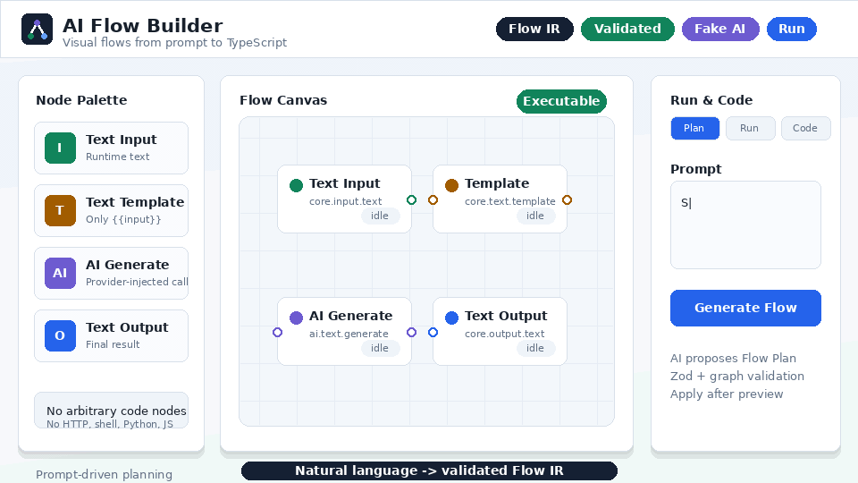

# AI Flow Builder

<p align="center">
  <a href="https://rsasaki0109.github.io/ai-flow-builder/">
    
  </a>
</p>

## What It Is

AI Flow Builder is a web-first visual programming platform for building small AI and text-processing flows. You place nodes, connect them, configure inputs and prompts, run the flow, and generate deterministic TypeScript from the same Flow IR.

The MVP is designed for local development and trusted single-user deployments. It intentionally avoids authentication, arbitrary code execution nodes, external HTTP request nodes, distributed workers, and plugin marketplaces.

## Play Online

A static GitHub Pages playground is available at:

https://rsasaki0109.github.io/ai-flow-builder/

The playground runs fully in the browser with a fake AI provider. It does not use the Next.js API, SQLite persistence, OpenAI, or server-side execution.

## MVP Features

- Browser-based visual editor with Text Input, Text Template, AI Generate, and Text Output nodes.
- Shared Flow IR used by the editor, validation, execution engine, AI planning, persistence, and code generation.
- SQLite/libSQL persistence through a modular Next.js monolith.
- Storage validation and executable validation with deterministic graph checks.
- Server-side sequential DAG execution with node-level trace output.
- AI-assisted flow planning through disabled, fake, and OpenAI provider adapters.
- Deterministic TypeScript code generation with copy and download support.
- Docker image with a persistent `/app/data` volume.
- Static GitHub Pages playground for trying the interaction model without a server.

## Quick Start

```bash
corepack enable
pnpm install --frozen-lockfile
cp .env.example .env
pnpm db:migrate
pnpm dev
```

Open `http://localhost:3000`.

The default configuration runs with AI disabled and stores data in `./data/ai-flow-builder.db`.

## Docker

Build and run with a persistent named volume:

```bash
docker compose up --build
```

Open `http://localhost:3000`.

The container stores SQLite data in `/app/data`, mounted from the `ai-flow-builder-data` volume. Stopping and starting the service keeps saved flows:

```bash
docker compose down
docker compose up
```

The image runs database migrations before starting the web server and exposes `/api/health` as its healthcheck.

## Environment

The app reads environment variables only through `apps/web/src/server/config.ts`.

| Variable                | Default                          | Notes                                        |
| ----------------------- | -------------------------------- | -------------------------------------------- |
| `NODE_ENV`              | `development`                    | `development`, `test`, or `production`       |
| `APP_ROOT`              | `.`                              | Base path for relative `file:` database URLs |
| `DATABASE_URL`          | `file:./data/ai-flow-builder.db` | Local SQLite/libSQL file URL                 |
| `AI_PROVIDER`           | `disabled`                       | `disabled`, `fake`, or `openai`              |
| `OPENAI_API_KEY`        | unset                            | Required only when `AI_PROVIDER=openai`      |
| `OPENAI_MODEL`          | unset                            | Required only when `AI_PROVIDER=openai`      |
| `AI_REQUEST_TIMEOUT_MS` | `45000`                          | Timeout for AI planning calls                |
| `FLOW_RUN_TIMEOUT_MS`   | `60000`                          | Timeout for flow execution                   |
| `LOG_LEVEL`             | `info`                           | Server log level                             |

For deterministic local or CI AI behavior:

```bash
AI_PROVIDER=fake pnpm dev
```

## AI Privacy

AI features are optional. With `AI_PROVIDER=disabled`, the application does not call an external AI provider. With `AI_PROVIDER=fake`, AI behavior is deterministic and local.

When `AI_PROVIDER=openai`, flow-generation prompts and AI node prompts are sent to the configured provider. API keys are server-only, are never exposed through `NEXT_PUBLIC_*`, and are redacted from logs.

## Quality Checks

```bash
pnpm format:check
pnpm lint
pnpm typecheck
pnpm test
pnpm check
pnpm --filter @ai-flow-builder/web build
AI_PROVIDER=fake pnpm test:e2e
```

## Architecture

AI Flow Builder is a modular monolith:

- `apps/web` contains the Next.js UI, API route handlers, server config, and application services.
- `packages/flow-core` contains Flow IR schemas, node specs, validation, and graph utilities.
- `packages/flow-engine` contains deterministic node executors and flow execution.
- `packages/ai` contains provider-neutral AI contracts, fake/disabled providers, OpenAI adapter, FlowPlan schema, and prompts.
- `packages/db` contains Drizzle schema and repository implementations.
- `packages/codegen` contains deterministic TypeScript generation.

Important boundaries:

- React Flow types are not persisted.
- Route handlers do not contain business logic or SQL.
- Environment variables are not read outside server config.
- LLM output is treated as untrusted and must pass schema and graph validation.
- Generated code is for display, copy, or download only. The app does not execute generated code.

## Limitations

- The MVP is single-user and has no authentication, workspace, RBAC, sharing, comments, or collaboration.
- Flows must be DAGs. Loops, branching, scheduling, queues, retries, long-running jobs, and deployment workflows are out of scope.
- The only built-in node data type currently exercised is text.
- The app does not include JavaScript, Python, shell, HTTP request, database query, file system, browser automation, MCP, or agent tool nodes.
- The GitHub Pages playground is a static browser demo and is not a replacement for the full local or Docker app.

## Roadmap

- Flow JSON import/export.
- Flow revision history.
- Authentication and workspaces.
- PostgreSQL adapter.
- Conditional nodes and broader port types.
- Execution history and asynchronous jobs.
- Compile-time plugin authoring.

## Contributing

See [CONTRIBUTING.md](CONTRIBUTING.md) for setup, scope, quality gates, and pull request expectations. This project follows the conduct expectations in [CODE_OF_CONDUCT.md](CODE_OF_CONDUCT.md).

## Security

See [SECURITY.md](SECURITY.md) for supported security expectations, private reporting guidance, and MVP deployment warnings.

## License

Apache-2.0. See [LICENSE](LICENSE).
